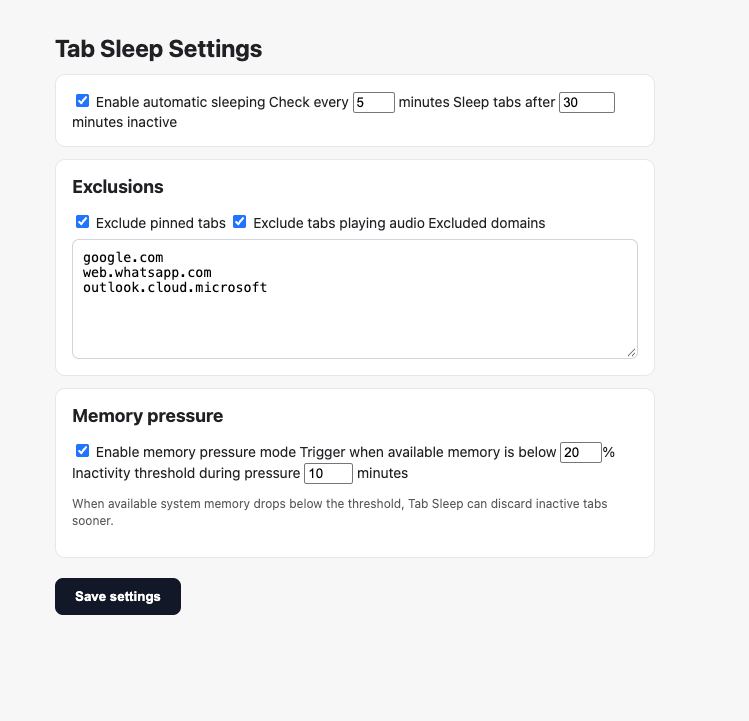

# Tab Sleep

A Chrome extension (Manifest V3) that automatically discards inactive tabs to reduce memory usage.

Discarded tabs stay in the tab strip but release their memory; they reload when you click on them.

## Features

- **Automatic sleeping**: periodically discards tabs that have been inactive longer than a configurable threshold (default: 30 minutes, checked every 5 minutes).
- **Exclusions**: skip pinned tabs, tabs playing audio, and any domains you list (subdomains included, e.g. `google.com` also covers `mail.google.com`).
- **Memory pressure mode**: when available system memory drops below a percentage (default: 20%), tabs are discarded sooner using a shorter inactivity threshold (default: 10 minutes).
- **Popup**: shows stats and memory status, lets you toggle sleeping, and has a "Sleep inactive tabs now" button.

## Installation

1. Clone or download this repository.
2. Open `chrome://extensions` and enable **Developer mode**.
3. Click **Load unpacked** and select the repository folder.

## Settings

Open the settings page from the popup's **Settings** button or via the extension's **Options**.

| Setting | Default |
| --- | --- |
| Enable automatic sleeping | On |
| Check every | 5 minutes |
| Sleep tabs after | 30 minutes inactive |
| Exclude pinned tabs | On |
| Exclude tabs playing audio | On |
| Excluded domains | (none) |
| Enable memory pressure mode | On |
| Trigger when available memory is below | 20% |
| Inactivity threshold during pressure | 10 minutes |

Settings are stored with `chrome.storage.sync`, so they follow your Chrome profile.

## Permissions

- `tabs`: query and discard tabs
- `storage`: save settings
- `alarms`: run periodic checks
- `system.memory`: read available memory for memory pressure mode
